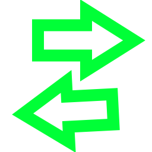
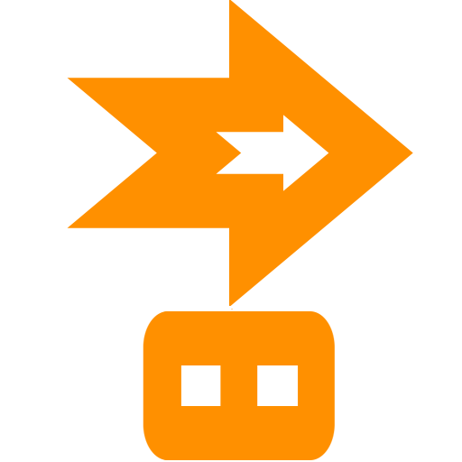

# Component

Component are very important if you want to create anything in ITWC, there are basicly custom node that you can drag and drop in a specific order to create easly any object in the game.

## Player Component

player component are the component specific to the player, you won't use them very often unless you want to modify or create custom player.

- ###  velocity component

**class name : velocityComponent**

the velocity component handle... velocity ! who would guess this... anyway this component allow you to do operation on velocity and get a final velocity after all your point mechanics

- ###  input handler

the input handler is kinda useless, it's more a remnant of IDWN, basicly he gather all input (hardcoded) and set boolean for each input that you can access. the only advantage of this component is that you have the possibility to block certain combination of input

- ###  repulse handler

repulse handler is basicly a component that allow you to push player back, very usefull if you have the covid-19

- ###  repulse handler zone 