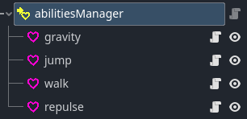

#  Abilities manager

# How to use

FINALLY A COMPONENT THAT WORK PROPERLY !!! anyways just drag and drop [abilities]() component to make them child of a abilitiesManager and every single abilities will be execute when needed

As an exemple here's the player abilitiesManager tree :



# Attributes

- ## abilitiesList : Array[[abilities]()]
    a list that contain every child (abilities) of the abilitiesManager ([load]() function must be called to fill the list) 

# Methods

- ## load -> none
    fill the [abilitiesList](#abilitieslist--arrayabilities) with all child of the abilitiesManager and load all abilities (see [abilities loading]())
    (and i know this function overwrite the built-in load function i'm sorry you can't load abilitiesManager because of my lack of skills)

- ## execute -> none
    When called, execute every active abilities who are in the [abilitiesList](#abilitieslist--arrayabilities)

# Additional note

in the player script, the abilitiesManager component is used like so :

```gdscript
velocityHandler.setCurrentVelocity(velocity)

#other code...

abilitieManager.execute(delta)

velocity = velocityHandler.getFinalVelocity()
move_and_slide()

```
so abilities modify the velocity of the velocityComponent and the player get the final velocity and apply it to him.


```gdscript
abilitieManager.load()
```
is called on _enter_tree() by the player