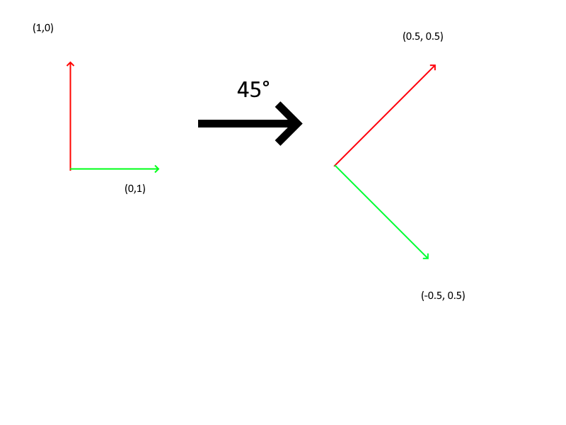

#  Camera Component

cinemachine for godot :)

## how to use

you won't have to touch this component. But if you do good luck.

## Attributes

- currentCameraZone : [cameraZone](), set to the cameraZone where the player is by the [GameManager]()


- ### deadZoneCoordinates : Vector4
    a vec4 composed by 2 vec2 representing the coordinates of two point, the two point are the two corner of a rectangle, coordinate are beetween 0 and 1 and represent the proportion on screen 
\
    /!\ Dead zone variable aren't use anymore but still here because cleaning is time consuming

- ### cameraDeadZoneSpeed : float
    the speed of the camera when the player exit the dead zone
\
/!\ Dead zone variable aren't use anymore but still here because cleaning is time consuming

- ### normalFOV : float
    the FOV of the camera in a totaly normal situation

- ### fovVariation : float
    the FOV value that will be added to the normalFOV

- ### cameraRot : float
    set to ```self.rotation_degrees.y```

- ### references : Vector4
    composition of two vec2 representing the x and y transformation vector

## Utils Methods

so the camera as a lot of methods, i cut the methods in two part : the utils methods for space (and time (i love doctor who srry)) transformation and the camera part for methods specific to the camera like movement. 

- ### ifObjectIsInDeadZone -> bool
    return if the object given in parameter is in the dead zone

    - #### parameter

        - ##### object : Node3D
            the object to check

- ### ifObjectIsCentered -> bool
    return true if the object is approximatly at the center of the screen, the function was definitly wrote by chatgpt tho

    - #### parameter

        - ##### object : Node3D
            the object to check

- ### getOnScreenObjectCoord -> Vector2
    return the object position on screen

    basicly : ```return self.unproject_position(object.global_position)```

    - #### parameter

        - ##### object : Node3D
            the object to check

- ### getNewReference -> none
    set the current cameraRot and reference to [NewReference(cameraRot)]()

    basicly : ```return self.unproject_position(object.global_position)```


- ### getProjectionVector -> Vector2
    rotate a vector ??? honestly idk what this one is but i think it's usefull '^^
    fell free to understand what it does
    ```
    var angleRad = deg_to_rad(angle)

	var x : float = curVec.x * cos(angleRad) + curVec.y * sin(angleRad)
	var y : float = - curVec.x * sin(angleRad) + curVec.y * cos(angleRad)
	return Vector2(x, y)
    ```

    - #### parameter

        - ##### curVec : Vector2

            the vector to rotate i guess 
        - ##### angle : float
            rotation need an angle so here it is

- ### NewReference -> Vector4
    ok big one, return a vector4 containing two vector2, so you can convert an x and y movement to a new reference :

    
    
    reference are two vector to transform the cartesian system of godot into another cartesian system with an offset angle of [angle](#angle--float-1)
    - #### parameter

        - ##### angle : float
            the angle in degree

- ### getNewDir -> Vector2

    this one is to convert any vector from a normal cartesian base to the cartesian base define by the [references attribute](#attributes)

    - #### parameters
        - ##### curDir : vector2
            your vector in a normal cartesian base (x and y)

- ### getNewDirY -> float
    the same as [getNewDir](#getnewdir---vector2) but with only the y vector for some reason, idk where this function is used tho.
    also the reasult is normalized

    - #### parameters

        - ##### curDir : vector2
            your vector in a normal cartesian base (x and y)

- ## Camera Methods

    - ### moveFromVect3
    ```gdscript
    self.position += vec
    ```
    pretty straight forward (hahaha i'm funny)

    - #### parameters

        - ##### vec : vector3
            vec for the new pos
    - ### moveToPos

    ```gdscript
    self.position = self.position.move_toward(pos, speed)
    ```
    - #### parameters

        - ##### pos : vector3
            the place to be
        - ##### speed : float
            speed ._.
    
    - ### rotateFromDegrees
        ```gdscript
        self.rotation += deg
        ```
        - #### parameters

            - ##### deg : vector3
                angle in degree (frik off radian)
    
    - ### getVectorToPoint -> Vector3
        ```gdscript
        return self.global_position - pos
        ```
        return the vector from point to camera

        - #### parameters

            - ##### pos : vector3
                the start position of the return vector
    - ### setFOV
        set the camera fov 

        - #### parameters
            - ##### fovValue : float
                the value to set
    
    - ### lerpFOV
        set camera field of view but with lerping because it's pretty :sparkles:

        - #### parameters
            - ##### fovValue : float
                the value to set
            - ##### speed : float
                speed needed in lerping