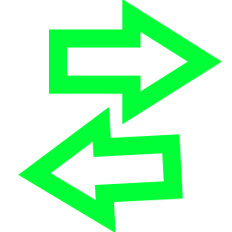
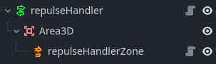
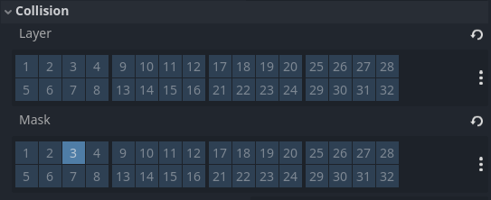
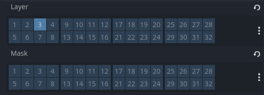

#  Repulse Handler

## How to use

repulse handler is a special component, indeed he's use to repulse player he is also use to set the zone where the player is repulsed, for exemple pnj will have a repulseHandler to push the player back but it will be configured differently.

To use a repulseHandler you need to set it up like so: 



the Area3D is just a normal Area3D with a [repulseHandlerZone](repulseHandlerZone.md) 

- ### for the player :

    the repulseHandler Area3D will have a mask set to 3 :
    

    the player must have a [repulse handler ability]() active for this to work.

- ### for the different repulse zone (like pnj)

    for repulse zone, just set a repulseHandler but with this time the layer set to 3

    

Then you'r almost done just set the different export variable (see [attributes](#attributes))


## Attributes

- force : float, @export_range of [1, 50], handle the force applied by the repulsion, the more this value is high the more you will be push back (no need to set a force for repulse zone just for player)

- collider : [repulseHandlerZone](repulseHandlerZone.md)

## Methods

- ### getOtherBody -> Array[[repulseHandler](repulseHandler.md)]

    return a list of every repulseHandler detect by the Area3D in the range of the [repulseHandlerZone](repulseHandlerZone.md)

    \
    no parameters

- ### repulse -> Vector2

    return the velocity vector needed to repulse the current body with the repulseHandler force, the more the body is near the other body, the more the repulse vector will be strong

    #### Parameters

    - ##### body : [repulseHandler](repulseHandler.md)
        the body to be repulse by
    - ##### thisBody : [Player]()
        the body to repulse

## additional note

the repulse handler will be use in the repulse ability like so : 
```gdscript
for body in player.repulseHandlerComponent.getOtherBody():
    player.velocityHandler.addVelocityXZ(player.repulseHandlerComponent.repulse(body,player) * delta)
```