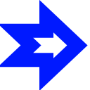

#  Velocity Handler

## how to use

velocityComponent is use to do operation on velocity, you want to use it like so : 

set the velocity of the velocity component with 
```gdscript
velocityHandler.setCurrentVelocity(velocity)
```
then you do your math with velocity using the methods of the velocity component

and finally you get the final velocity of your velocity component and set the velocity of your node with the velocity of the velocity component like so (code from the main player script) 
```gdscript
velocity = velocityHandler.getFinalVelocity()
```
## attributes

the velocityHandler have only one attribute

- Velocity : Vector3, store the velocity of the velocityComponent, set with setCurrentVelocity and get with getFinalVelocity()

## methods

- ### setCurrentVelocity -> None
    set the velocityComponent velocity to the velocity given in parameter
    - #### Parameter
        - ##### velocity : Vector3
             

- ### applyGravity -> None
    the force apply by frame torward the ground
    - #### Parameter
        - ##### gravityForce : float
            
        - ##### delta : float
            [delta](https://docs.godotengine.org/en/stable/tutorials/scripting/idle_and_physics_processing.html)

- ### setVelocityX -> None
    set the velocity.x of the velocity component 
    - #### Parameter
        - ##### velocityX : float
            

- ### setVelocityY -> None
    set the velocity.y of the velocity component
    - #### Parameter
        - ##### velocityY : float
             

- ### setVelocityZ -> None
    set the velocity.z of the velocity component 
    - #### Parameter
        - ##### velocityZ : float
            

- ### setVelocityXZ -> None
    set the velocity.x and velocity.z of the velocity component with velocityXZ.x and velocityXZ.y
    - #### Parameter
        - ##### velocityXZ : Vector2
                 

- ### lerpVelocityXZ -> None
    lerp the velocity.x and velocity.z of the velocity component with velocityXZ.x and velocityXZ.y with a speed given in parameter
    - #### Parameter
        - ##### velocityXZ : Vector2
        - ##### speed : float
            
- ### addVelocityXZ -> None
    add velocity on the x and z axis to the veloctity of the velocity component
    - #### Parameter
        - ##### velocityAdd : Vector2

- ### getFinalVelocity -> None
    return the Velocity attribute, is use to set the velocity of a node with a velocity after physics calcul